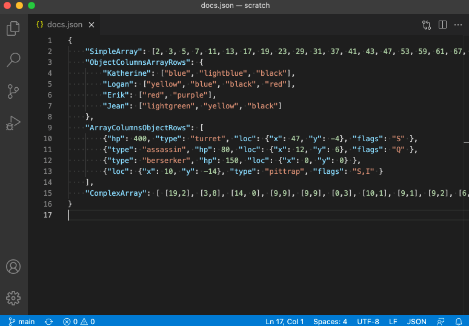
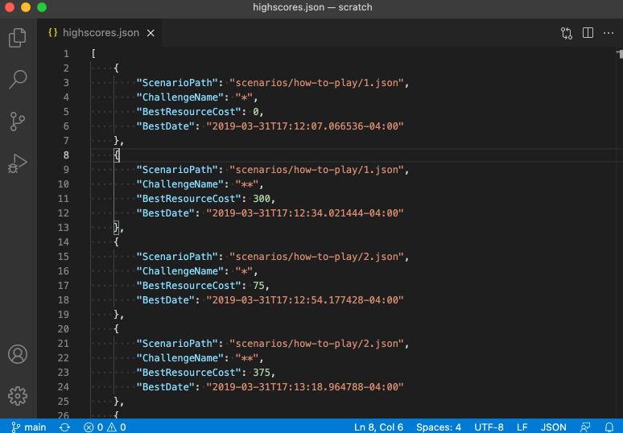

# FracturedJson for Visual Studio Code

A JSON formatter that produces human-readable but fairly compact output.

* Arrays and objects are written on single lines, if their contents aren't too complex and the resulting line wouldn't be too long.
* Arrays can be written on multiple lines, with multiple items per line, as long as those items aren't too complex.
* Otherwise, each object property or array item is written begining on its own line, indented one step deeper than its parent.
* If several successive inline arrays or objects are similar enough, they will be formatted as a table.

This VSCode extension is part of a family of FracturedJson tools.  Check out the [browser-based formatter](https://j-brooke.github.io/FracturedJson/) to see related projects and to play around with the various formatting options.


---

## Features

This extension can be used either with VSCode's built-in formatting features, or invoked through four commands (from the Command Palette, or whatever keybindings you set by clicking on the gear symbol next to the command in the Command Palette).


### Format JSON Document Command

The **Format JSON Document** command reformats the entire document, inlining arrays and objects up to a certain degree of complexity and length, and then expanding the rest of the rest.  You can adjust the behavior with the extension's settings.





### Format JSON Selection Command

You can use the **Format JSON Selection** command to reformat just a piece of the document, if desired.  The selection must be a well-formed JSON element on its own.  (Although some leading and training text will automatically be skips: whitespace, commas, and leading propety names with colons.)


### Minify JSON Document Command

**Minify JSON Document** reformats the document as small as possible, just like every other minification tool out there.  (It's the same as JavaScript's `JSON.stringify` with no extra options.)


### Near-minify JSON Document Command

If your document's root element is an array with many children, it might be useful to use **Near-minify JSON Document**.  This will produce a document where each of the root element's children are separated by newlines, but otherwise minified.  This saves space but still allows you to pick out individual items (which you might then choose to expand with **Format JSON Selection** for instance).




### Formatting API

The extension registers with VSCode as a formatting provider.  You can set it as your default JSON formatter, or use it as-needed by selecting the "Format Document With..." or "Format Selection With..." commands from a JSON editor's context menu.  If set as your default JSON formatter, it will be used for features like `Editor: Format On Save`, if enabled.

The easiest way to set your default editor is to right-click in a JSON document and choose "Format Document With..." from the context menu.  It will show a drop-down list of available format providers, as well as the option, "Configure Default Formatter...".

Alternately, you can set your default editor by adjusting your `settings.json` file:
```
    "[json]": {
        "editor.defaultFormatter": "j-brooke.fracturedjsonvsc"
    },
```

---

## Extension Settings

You can tune the formatting behavior with the properties in Settings -> Extensions -> FracturedJson.  The most important settings are:

* `Max Inline Length`: Maximum length (not counting indentation) of a complex element on a single line.
* `Max Inline Complexity`: Maximum nesting level that can be displayed on a single line.
* `Max Compact Array Complexity`: Maximum nesting level that can be arranged spanning multiple lines, with multiple items per line.

Indentation is controlled by the editor's standard settings (`editor.insertSpaces`, `editor.tabSize`, `editor.detectIndentation`, etc.).

Examples of all of the settings can be found on the [Options wiki page](https://github.com/j-brooke/FracturedJson/wiki/Options).  You can also experiment with the same functionality on the [browser-based formatter](https://j-brooke.github.io/FracturedJson/) page.


---

## Limitations and Troubleshooting

### JSON vs JSONC vs JavaScript

FracturedJson only works on pure JSON documents, not "JSON With Comments", and not JavaScript.  The latter two allow some syntax - such as comments - that isn't legal in JSON.

### Format Selection Doesn't Always Work

FracturedJson's **Format JSON Selection** feature basically only works if the selection is a single complete JSON element: an array, object, number, etc.  It can't help if the selection contains multiple items from an array or spans a syntactically incomplete portion of the document.  (That said, it does cut you some slack by ignoring leading/trailing whitespace and commas, and leading property names with colons.)

---

## Release Notes

### 2.2.1

* New setting `String Width Policy` determines how many spaces are used as padding to line up columns when formatted as a table.
    * Option `EastAsianFullWidth` (default) uses two spaces for East Asian "fullwidth" symbols, and one space for others.
    * Option `CharacterCount` treats each character as having the width of one space.
* New setting `Simple Bracket Padding` controls whether brackets should have spaces inside when they contain only simple elements.  (The old setting `Nested Bracket Padding` is used when they contain other arrays/objects.)


### 2.1.0

* Hooked into VSCode's formatter API, allowing FracturedJson to be used as a default formatter.  That allows for such features as format-on-save, format-on-paste, etc.
* Updated to FracturedJsonJS 2.0.1 behind the scenes to fix a bug where escaped characters in property names weren't being preserved, resulting in invalid JSON.

### 2.0.0

FracturedJson now tries to format collections of inline arrays/objects in a tabular arrangement if it seems to make sense.  Two new settings - `Table Object Minimum Similarity` and `Table Array Minimum Similarity` - control how similar the inlined elements need to be to their siblings to qualify.  (Other settings, like `Max Inline Length` also factor in.)

In tables, and in arrays of just numbers, numbers are usually written right-aligned and with the same precision.  You can disable this behavior with the setting `Don't Justify Numbers`.

### 1.0.0

Initial release